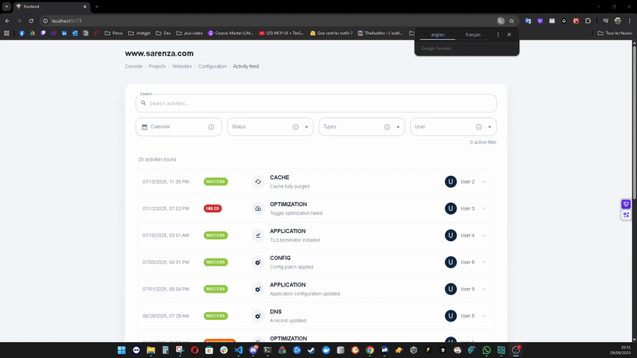

# Activity Feed — README

Un flux d’activité filtrable (statut, type, utilisateur, plage de dates) construit avec React + Vite.

## Démo



## Installation

```bash
npm install
npm run dev    # http://localhost:5173/
```

Build & utilitaires:

```bash
npm run build      # build de production
npm run preview    # prévisualiser le build
npm run lint       # ESLint
npm run typecheck  # TypeScript --noEmit
```

## À propos

- Données: `src/data/activities.json` (échantillon d’évènements)
- Filtres: Statut, Type, Utilisateur, Plage de dates (bornes inclusives)
- Reset: réinitialise tous les filtres
- URL: les filtres sont reflétés dans la query (`status`, `type`, `user`, `from`, `to`) pour partage

### Architecture rapide

- Feature‑first: tout le code du flux est sous `src/ActivityFeed/` (liste, filtres, store, hooks, types).
- Store: `ActivityFeed/store` (Zustand vanilla + Provider React).
- Hooks: `ActivityFeed/hooks` (dont `hooks/filters` pour chaque filtre).
- Outils partagés: `src/shared/utils` (dates, filtre/pagination, collecte d’options).

### Pourquoi Zustand (bref)

- Léger, sans boilerplate (pas d’actions/slices), parfait pour un état « feature‑scopé ».
- Performance: sélecteurs ciblés + `shallow` → pas de re‑renders inutiles.
- Facile à tester/faire évoluer (un store par feature).

### Performance côté UI

- Sélectionne seulement ce qui est nécessaire (selectors Zustand + `shallow`).
- Compare avant d’écrire (listes/dates) → pas de set() superflu.
- `getActivitiesPage`: filtre + pagination en un seul passage (O(n)).

### Synchro URL (nuqs)

- Clés: `status`, `type`, `user`, `from`, `to` (pagination volontairement non synchronisée).
- Chaque filtre gère sa propre clé (co‑localisé) et met à jour l’URL sans boucle grâce à un garde local.
- Coller une URL (ex: `?status=IN_PROGRESS` ou `?from=…&to=…`) applique les filtres.

## V2 — Améliorations proposées

- Performance & scalabilité

  - Virtualisation de la liste (react-window) quand les données dépassent quelques milliers d’items.
  - `useTransition` pour marquer les mises à jour de résultats comme non urgentes lors des saisies.
  - `useDeferredValue` sur la recherche pour garder l’input fluide et différer le rendu lourd.
  - Option serveur: pagination/filtrage côté API (SWR/React Query) avec cache et pré‑fetch.

- Recherche & filtres

  - Sauvegarde de presets de filtres (favoris) + « Quick ranges » (7/30 jours, ce mois).

- UX & accessibilité

  - Navigation clavier complète (focus trap dans les popovers, raccourcis / pour focus search).
  - État « pending » visible pendant les transitions longues; skeletons pour la liste.
  - Amélioration mobile: contrôles compacts, pagination « load more » optionnelle.

- Internationalisation & temps

  - i18n (react-intl ou i18next), formats date/nombre localisés, fuseaux horaires configurables.
  - Option inclusive/exclusive sur la borne de fin selon le besoin métier.

- État & URL

  - Compression des paramètres de filtres complexes (ex. LZ-string) pour des URL plus courtes.
  - Hook utilitaire unifié pour la synchro URL (facteur commun aux 4 filtres + recherche).

- Qualité & outillage

  - Tests e2e (Playwright) sur les scénarios clés (dates, FAILED, combinés, partage d’URL).

- Intégration API (optionnel)
  - Contrat de données typé (zod) + redaction côté UI des champs sensibles des diffs.
  - Gestion d’erreurs réseau (retry, toasts) et désactivation contrôles pendant le chargement.
